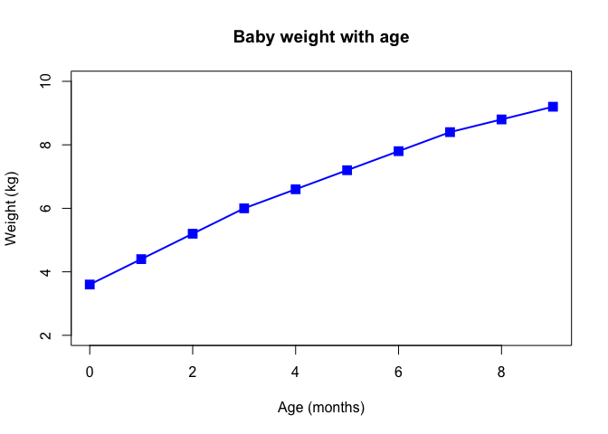

Class5 R Introduction
================
Shabnam Hamdard
May 3rd, 2014

``` r
# Class5 Data Visualization
x <- rnorm(1000)

# some summary stats
mean(x)
```

    ## [1] -0.0172716

``` r
sd(x)
```

    ## [1] 1.030861

``` r
summary(x)
```

    ##     Min.  1st Qu.   Median     Mean  3rd Qu.     Max. 
    ## -2.98341 -0.73014 -0.01859 -0.01727  0.70136  3.14969

``` r
boxplot(x)
```

<!-- -->

``` r
hist(x)
```

<!-- -->

``` r
# Section 2 Scatterplots

# main is used for the main title of the graph

baby <- read.table("bimm143_05_rstats/weight_chart.txt", header = TRUE)
plot(baby, type="o",
     pch=15, cex=1.5, lwd=2, ylim=c(2,10),
     xlab = "Age (months)", ylab = "Weight (kg)",
     main = "Baby weight with age", col="blue")
```

<!-- -->

``` r
# xlim used to extend x axis, \t separates by tab
# las used for the orientations of the labels

mouse <- read.table("bimm143_05_rstats/feature_counts.txt", sep = "\t", header = TRUE)
par(mar=c(3.1, 11.1, 4.1, 2))
barplot(mouse$Count, names.arg = mouse$Feature,
        horiz= TRUE, ylab = "",
        main = "Number of features in the mouse GRCm38 genome",
        las = 1, xlim = c(0,80000))
```

<!-- -->

``` r
x <- c(rnorm(10000),rnorm(10000)+4)
hist(x, breaks=50)
```

<!-- -->

``` r
# alternating colors for each column

mf <- read.delim("bimm143_05_rstats/male_female_counts.txt")
par(mar=c(6, 3, 3, 1))
barplot(mf$Count, names.arg = mf$Sample,  col=c("blue2", "red2"),
        las = 2, ylab = "Counts")
```

<!-- -->

``` r
# colors

genes <- read.delim("bimm143_05_rstats/up_down_expression.txt")
plot(genes$Condition1, genes$Condition2, col = genes$State)
```

<!-- -->

``` r
palette(c("red", "green", "blue"))

# density

meth <- read.delim("bimm143_05_rstats/expression_methylation.txt")
dcols <- densCols(meth$gene.meth, meth$expression)
plot(meth$gene.meth, meth$expression, col = dcols, pch = 20)
```

<!-- -->

``` r
# restricts the plot to show values above 0 only

inds <- meth$expression > 0
plot(meth$gene.meth[inds], meth$expression[inds])
```

<!-- -->

``` r
dcols <- densCols(meth$gene.meth[inds], meth$expression[inds])
plot(meth$gene.meth[inds], meth$expression[inds], col = dcols, pch = 20)
```

<!-- -->

``` r
# fancier colors

dcols.custom <- densCols(meth$gene.meth[inds], meth$expression[inds],
                         colramp = colorRampPalette(c("blue2",
                                                      "green2",
                                                      "red2",
                                                      "yellow")) )

plot(meth$gene.meth[inds], meth$expression[inds], 
     col = dcols.custom, pch = 20)
```

<!-- -->
