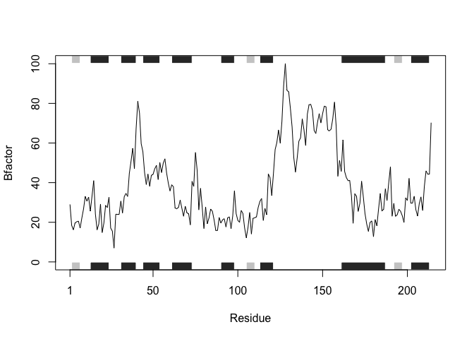
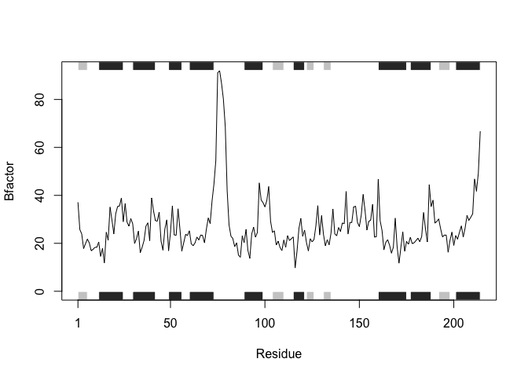
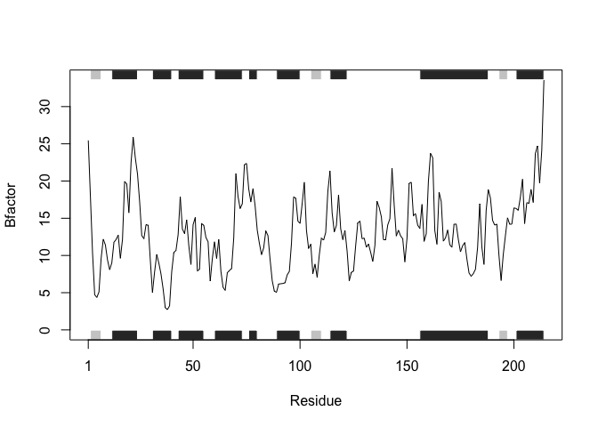

Class6 R Functions
================
Shabnam Hamdard
10/17/2019

# This is H1

This is my work from class 06 in **BIMM 143**.

``` r
# this is to demo a code chunk
plot(1:10)
```

<!-- -->

## Practice reading files (again…)

``` r
read.table("test1.txt", sep=",", header=TRUE)
```

    ##   Col1 Col2 Col3
    ## 1    1    2    3
    ## 2    4    5    6
    ## 3    7    8    9
    ## 4    a    b    c

``` r
# Shortcut
read.csv("test1.txt")
```

    ##   Col1 Col2 Col3
    ## 1    1    2    3
    ## 2    4    5    6
    ## 3    7    8    9
    ## 4    a    b    c

``` r
read.table("test2.txt", sep="$", header=TRUE)
```

    ##   Col1 Col2 Col3
    ## 1    1    2    3
    ## 2    4    5    6
    ## 3    7    8    9
    ## 4    a    b    c

``` r
read.table("test3.txt", sep="")
```

    ##   V1 V2 V3
    ## 1  1  6  a
    ## 2  2  7  b
    ## 3  3  8  c
    ## 4  4  9  d
    ## 5  5 10  e

## Functions

``` r
add <- function(x, y=1) {
        # Sum the input x and y
        x + y
}
```

``` r
add(1)
```

    ## [1] 2

``` r
# add(5, "barry")
```

A new function to re-scale data

``` r
rescale <- function(x) {
  rng <- range(x)
  (x - rng[1]) / (rng[2] - rng[1])
}
```

``` r
rescale(1:10)
```

    ##  [1] 0.0000000 0.1111111 0.2222222 0.3333333 0.4444444 0.5555556 0.6666667
    ##  [8] 0.7777778 0.8888889 1.0000000

``` r
x <- c(1,2,NA,3,10)
rng <- range(x, na.rm = TRUE)
rng
```

    ## [1]  1 10

``` r
rescale2 <- function(x) {
  rng <- range(x, na.rm = TRUE)
  (x - rng[1]) / (rng[2] - rng[1])
}
rescale2(c(1,2,NA,3,10))
```

    ## [1] 0.0000000 0.1111111        NA 0.2222222 1.0000000

``` r
rescale3 <- function(x, na.rm=TRUE, plot=FALSE) {
  
    rng <-range(x, na.rm=na.rm)
    print("Hello")
 
    answer <- (x - rng[1]) / (rng[2] - rng[1])
    print("is it me you are looking for?")
 
    if(plot) {
      plot(answer, typ="b", lwd=4)
 }
    print("I can see it in ...")
    return(answer)
}
```

``` r
rescale3(1:10)
```

    ## [1] "Hello"
    ## [1] "is it me you are looking for?"
    ## [1] "I can see it in ..."

    ##  [1] 0.0000000 0.1111111 0.2222222 0.3333333 0.4444444 0.5555556 0.6666667
    ##  [8] 0.7777778 0.8888889 1.0000000

# Section 2 Hands On

Install the **bio3d** package for sequence and structure analysis.

``` r
#install.packages("bio3d")
```

``` r
library(bio3d)
s1 <- read.pdb("4AKE") # kinase with drug
```

    ##   Note: Accessing on-line PDB file

``` r
s2 <- read.pdb("1AKE") # kinase no drug
```

    ##   Note: Accessing on-line PDB file
    ##    PDB has ALT records, taking A only, rm.alt=TRUE

``` r
s3 <- read.pdb("1E4Y") # kinase with drug
```

    ##   Note: Accessing on-line PDB file

``` r
s1.chainA <- trim.pdb(s1, chain="A", elety="CA")
s2.chainA <- trim.pdb(s2, chain="A", elety="CA")
s3.chainA <- trim.pdb(s3, chain="A", elety="CA")

s1.b <- s1.chainA$atom$b
s2.b <- s2.chainA$atom$b
s3.b <- s3.chainA$atom$b

plotb3(s1.b, sse=s1.chainA, typ="l", ylab="Bfactor")
```

<!-- -->

``` r
plotb3(s2.b, sse=s2.chainA, typ="l", ylab="Bfactor")
```

<!-- -->

``` r
plotb3(s3.b, sse=s3.chainA, typ="l", ylab="Bfactor")
```

<!-- -->

``` r
graph <- function(x) {
    print("Hello")
}
```
