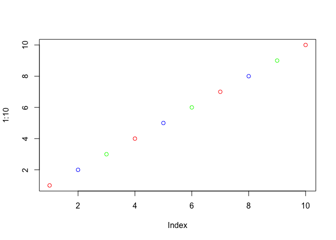

class07
================
Shabnam Hamdard
10/22/2019

## R Functions Revisited

Source my functions from last
    day

``` r
source("http://tinyurl.com/rescale-R")
```

``` r
rescale(1:10)
```

    ##  [1] 0.0000000 0.1111111 0.2222222 0.3333333 0.4444444 0.5555556 0.6666667
    ##  [8] 0.7777778 0.8888889 1.0000000

``` r
rescale( c(1, 10, 5, NA, 6))
```

    ## [1] 0.0000000 1.0000000 0.4444444        NA 0.5555556

``` r
# rescale2(c(1:10, "pizza"))
```

``` r
# rescale(c(1:10, "pizza"))
```

## A new function called both\_na()

Write a function to find where there are NA elements in two input
vectors.

First make some simple input where I know the answer.

``` r
x <- c(1, 2, NA, 3, NA)
y <- c(NA, 3, NA, 3, 4)
```

Looked online and found the **is.na** function.

``` r
is.na(x)
```

    ## [1] FALSE FALSE  TRUE FALSE  TRUE

And the **which()** function tells me where the true values are.

``` r
which(is.na(x))
```

    ## [1] 3 5

``` r
which(is.na(y))
```

    ## [1] 1 3

``` r
is.na(x)
```

    ## [1] FALSE FALSE  TRUE FALSE  TRUE

``` r
is.na(y)
```

    ## [1]  TRUE FALSE  TRUE FALSE FALSE

The AND function requires two input TRUE to give a TRUE output.

``` r
is.na(x) & is.na(y)
```

    ## [1] FALSE FALSE  TRUE FALSE FALSE

Taking the **sum()** of TRUE FALSE vector will tell me how many TRUE
elements I have. This is my working snippet\!

``` r
sum(is.na(x) & is.na(y))
```

    ## [1] 1

``` r
sum( c(TRUE, TRUE, FALSE, TRUE) )
```

    ## [1] 3

Now turn it into a function.

``` r
both_na <- function(x, y) {
  sum( is.na(x) & is.na(y) )
}
```

``` r
both_na(c(1, NA, 3, NA, 4), c(3, NA, 4, 2, NA))
```

    ## [1] 1

Test Function

``` r
x <- c(NA, NA, NA)
y1 <- c(1, NA, NA)
y2 <- c(1, NA, NA, NA)
```

``` r
both_na(x, y2)
```

    ## Warning in is.na(x) & is.na(y): longer object length is not a multiple of
    ## shorter object length

    ## [1] 3

``` r
x2 <- c(NA, NA)
both_na(x2, y2)
```

    ## [1] 3

``` r
plot(1:10, col=c("red", "blue", "green"))
```

<!-- -->

``` r
x3 <- c(1, NA, NA)
y3 <- c(1, NA, NA, NA, NA, NA, NA)
both_na(x3, y3)
```

    ## Warning in is.na(x) & is.na(y): longer object length is not a multiple of
    ## shorter object length

    ## [1] 4

``` r
x3 <- c(1, NA, NA, 1, NA, NA, 1)
y3 <- c(1, NA, NA, NA, NA, NA, NA)
```

``` r
length(x)
```

    ## [1] 3

``` r
length(y3)
```

    ## [1] 7

Add a check for when inputs x and y are not the same length.

``` r
both_na2 <- function(x, y) {
  if(length(x) != length(y)) {
    stop("Input x and y are not of equal length!")
  }
  sum( is.na(x) & is.na(y) )
}
```

``` r
# both_na2(x, y3)
```

``` r
# student 1
s1 <- c(100, 100, 100, 100, 100, 100, 100, 90)

# student 2
s2 <- c(100, NA, 90, 90, 90, 90, 97, 80)

mean(s1[ -which.min(s1) ])
```

    ## [1] 100

``` r
which.min(s2)
```

    ## [1] 8

``` r
s2[ -which.min(s2) ]
```

    ## [1] 100  NA  90  90  90  90  97

``` r
mean(s2 [- which.min(s2) ], na.rm = TRUE)
```

    ## [1] 92.83333

We have our working code. Now, we can turn it into a function.

``` r
grade <- function(x) {
  if (any(is.na(x)) ) {
    warning("Student is missing a homework!")
  }
  mean( x[-which.min(x) ], na.rm=TRUE)
}
```

``` r
grade(s1)
```

    ## [1] 100

``` r
grade(s2)
```

    ## Warning in grade(s2): Student is missing a homework!

    ## [1] 92.83333

``` r
url <- "https://tinyurl.com/gradeinput"
hw <- read.csv(url, row.names=1)
```

``` r
apply(hw, 1, grade)
```

    ## Warning in FUN(newX[, i], ...): Student is missing a homework!
    
    ## Warning in FUN(newX[, i], ...): Student is missing a homework!
    
    ## Warning in FUN(newX[, i], ...): Student is missing a homework!
    
    ## Warning in FUN(newX[, i], ...): Student is missing a homework!

    ##  student-1  student-2  student-3  student-4  student-5  student-6 
    ##   91.75000   82.50000   84.25000   88.00000   88.25000   89.00000 
    ##  student-7  student-8  student-9 student-10 student-11 student-12 
    ##   94.00000   93.75000   87.75000   81.33333   86.00000   91.75000 
    ## student-13 student-14 student-15 student-16 student-17 student-18 
    ##   92.25000   87.75000   83.33333   89.50000   88.00000   97.00000 
    ## student-19 student-20 
    ##   82.75000   82.75000

``` r
grades <- function(x) {
  ordered_list <- sort(x, decreasing = TRUE, na.last = TRUE)
  new_grades <- head(ordered_list, -1)
  print(paste("The average is", mean(new_grades)))
  return(new_grades)
}

grades(s1)
```

    ## [1] "The average is 100"

    ## [1] 100 100 100 100 100 100 100

``` r
grades(s2)
```

    ## [1] "The average is 91"

    ## [1] 100  97  90  90  90  90  80

``` r
grade2 <- function(x) {
  if (any(is.na(x)) ) {
    warning("Student is missing a homework!")
  }
  sum(mean( x[-which.min(x) ], na.rm=TRUE))/(length(x)-1)
}
```

``` r
s3 <- c(100, NA, NA, NA, NA)
grade2(s3)
```

    ## Warning in grade2(s3): Student is missing a homework!

    ## [1] NaN
