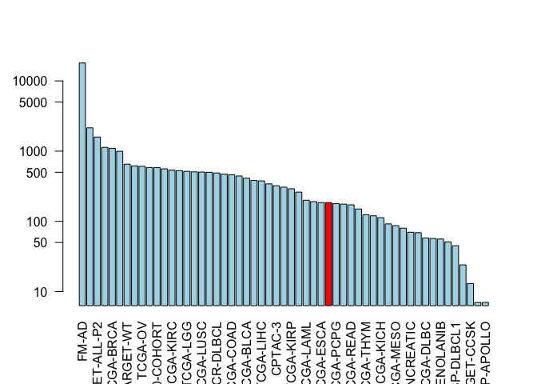

class18
================
Shabnam Hamdard
11/26/2019

## Part One

``` r
library(GenomicDataCommons)
```

    ## Loading required package: magrittr

    ## 
    ## Attaching package: 'GenomicDataCommons'

    ## The following object is masked from 'package:stats':
    ## 
    ##     filter

``` r
library(TCGAbiolinks)
library(maftools)
```

``` r
status()
```

    ## $commit
    ## [1] "955a105f3f2ba797e1d9d8de013226a495feae56"
    ## 
    ## $data_release
    ## [1] "Data Release 20.0 - November 11, 2019"
    ## 
    ## $status
    ## [1] "OK"
    ## 
    ## $tag
    ## [1] "1.23.0"
    ## 
    ## $version
    ## [1] 1

``` r
projects <- getGDCprojects()
head(projects)
```

    ##   dbgap_accession_number
    ## 1                   <NA>
    ## 2                   <NA>
    ## 3              phs000466
    ## 4                   <NA>
    ## 5              phs000467
    ## 6              phs000465
    ##                                                                                                                                           disease_type
    ## 1                                                                                                                                Mesothelial Neoplasms
    ## 2                                                                                                                         Adenomas and Adenocarcinomas
    ## 3                                                                                                                  Complex Mixed and Stromal Neoplasms
    ## 4 Myomatous Neoplasms, Soft Tissue Tumors and Sarcomas, NOS, Fibromatous Neoplasms, Lipomatous Neoplasms, Nerve Sheath Tumors, Synovial-like Neoplasms
    ## 5                                                                                                       Neuroepitheliomatous Neoplasms, Not Applicable
    ## 6                                                                                                                    Myeloid Leukemias, Not Applicable
    ##   releasable released state
    ## 1      FALSE     TRUE  open
    ## 2      FALSE     TRUE  open
    ## 3      FALSE     TRUE  open
    ## 4      FALSE     TRUE  open
    ## 5       TRUE     TRUE  open
    ## 6       TRUE     TRUE  open
    ##                                                                                                                                                                                                                                                                                                                                                                                                                                                                                                                                                                                                                   primary_site
    ## 1                                                                                                                                                                                                                                                                                                                                                                                                                                                                                                                                                                            Heart, mediastinum, and pleura, Bronchus and lung
    ## 2                                                                                                                                                                                                                                                                                                                                                                                                                                                                                                                                                                                                                Adrenal gland
    ## 3                                                                                                                                                                                                                                                                                                                                                                                                                                                                                                                                                                                                                       Kidney
    ## 4                                                                                                                                                                                                                                                                                        Corpus uteri, Stomach, Other and unspecified parts of tongue, Meninges, Other and unspecified male genital organs, Colon, Connective, subcutaneous and other soft tissues, Bones, joints and articular cartilage of limbs, Ovary, Retroperitoneum and peritoneum, Peripheral nerves and autonomic nervous system, Uterus, NOS, Kidney
    ## 5 Heart, mediastinum, and pleura, Stomach, Bones, joints and articular cartilage of other and unspecified sites, Lymph nodes, Liver and intrahepatic bile ducts, Unknown, Uterus, NOS, Skin, Other endocrine glands and related structures, Adrenal gland, Renal pelvis, Connective, subcutaneous and other soft tissues, Bones, joints and articular cartilage of limbs, Other and ill-defined sites, Meninges, Spinal cord, cranial nerves, and other parts of central nervous system, Retroperitoneum and peritoneum, Peripheral nerves and autonomic nervous system, Hematopoietic and reticuloendothelial systems, Kidney
    ## 6                                                                                                                                                                                                                                                                                                                                                                                                                                                                                                                                                                       Unknown, Hematopoietic and reticuloendothelial systems
    ##    project_id          id                             name tumor
    ## 1   TCGA-MESO   TCGA-MESO                     Mesothelioma  MESO
    ## 2    TCGA-ACC    TCGA-ACC         Adrenocortical Carcinoma   ACC
    ## 3 TARGET-CCSK TARGET-CCSK Clear Cell Sarcoma of the Kidney  CCSK
    ## 4   TCGA-SARC   TCGA-SARC                          Sarcoma  SARC
    ## 5  TARGET-NBL  TARGET-NBL                    Neuroblastoma   NBL
    ## 6  TARGET-AML  TARGET-AML           Acute Myeloid Leukemia   AML

``` r
cases_by_project <- cases() %>%
  facet("project.project_id") %>%
  aggregations()
head(cases_by_project)
```

    ## $project.project_id
    ##                      key doc_count
    ## 1                  FM-AD     18004
    ## 2             TARGET-AML      2146
    ## 3          TARGET-ALL-P2      1587
    ## 4             TARGET-NBL      1132
    ## 5              TCGA-BRCA      1098
    ## 6          MMRF-COMMPASS       995
    ## 7              TARGET-WT       652
    ## 8               TCGA-GBM       617
    ## 9                TCGA-OV       608
    ## 10             TCGA-LUAD       585
    ## 11     BEATAML1.0-COHORT       583
    ## 12             TCGA-UCEC       560
    ## 13             TCGA-KIRC       537
    ## 14             TCGA-HNSC       528
    ## 15              TCGA-LGG       516
    ## 16             TCGA-THCA       507
    ## 17             TCGA-LUSC       504
    ## 18             TCGA-PRAD       500
    ## 19          NCICCR-DLBCL       489
    ## 20             TCGA-SKCM       470
    ## 21             TCGA-COAD       461
    ## 22             TCGA-STAD       443
    ## 23             TCGA-BLCA       412
    ## 24             TARGET-OS       383
    ## 25             TCGA-LIHC       377
    ## 26               CPTAC-2       342
    ## 27               CPTAC-3       322
    ## 28             TCGA-CESC       307
    ## 29             TCGA-KIRP       291
    ## 30             TCGA-SARC       261
    ## 31             TCGA-LAML       200
    ## 32         TARGET-ALL-P3       191
    ## 33             TCGA-ESCA       185
    ## 34             TCGA-PAAD       185
    ## 35             TCGA-PCPG       179
    ## 36              OHSU-CNL       176
    ## 37             TCGA-READ       172
    ## 38             TCGA-TGCT       150
    ## 39             TCGA-THYM       124
    ## 40            CGCI-BLGSP       120
    ## 41             TCGA-KICH       113
    ## 42              TCGA-ACC        92
    ## 43             TCGA-MESO        87
    ## 44              TCGA-UVM        80
    ## 45   ORGANOID-PANCREATIC        70
    ## 46             TARGET-RT        69
    ## 47             TCGA-DLBC        58
    ## 48              TCGA-UCS        57
    ## 49 BEATAML1.0-CRENOLANIB        56
    ## 50             TCGA-CHOL        51
    ## 51           CTSP-DLBCL1        45
    ## 52         TARGET-ALL-P1        24
    ## 53           TARGET-CCSK        13
    ## 54             HCMI-CMDC         7
    ## 55        VAREPOP-APOLLO         7

``` r
x <- cases_by_project$project.project_id

# Make a custom color vector for our plot
colvec <- rep("lightblue", nrow(x))
colvec[x$key == "TCGA-PAAD"] <- "red"

# Plot with 'log' for y axis and rotate labels with 'las'
#par(___)  
barplot(x$doc_count, names.arg= x$key, log="y", col=colvec, las=2)
```

<!-- -->

``` r
samp <- getSampleFilesSummary("TCGA-PAAD")
```

    ## Accessing information for project: TCGA-PAAD

    ## Warning in data.table::dcast(., .id ~ data_category + data_type +
    ## experimental_strategy + : The dcast generic in data.table has been passed
    ## a data.frame and will attempt to redirect to the reshape2::dcast; please
    ## note that reshape2 is deprecated, and this redirection is now deprecated as
    ## well. Please do this redirection yourself like reshape2::dcast(.). In the
    ## next version, this warning will become an error.

    ## Using 'state_comment' as value column. Use 'value.var' to override

    ## Aggregation function missing: defaulting to length

``` r
head(samp)
```

    ##            .id Biospecimen_Biospecimen Supplement
    ## 1 TCGA-2J-AAB1                                 14
    ## 2 TCGA-2J-AAB4                                 14
    ## 3 TCGA-2J-AAB6                                 14
    ## 4 TCGA-2J-AAB8                                 14
    ## 5 TCGA-2J-AAB9                                 14
    ## 6 TCGA-2J-AABA                                 14
    ##   Biospecimen_Slide Image_Diagnostic Slide
    ## 1                                        1
    ## 2                                        1
    ## 3                                        1
    ## 4                                        1
    ## 5                                        1
    ## 6                                        1
    ##   Biospecimen_Slide Image_Tissue Slide Clinical_Clinical Supplement
    ## 1                                    1                            8
    ## 2                                    1                            8
    ## 3                                    1                            8
    ## 4                                    1                            8
    ## 5                                    1                            8
    ## 6                                    1                            8
    ##   Copy Number Variation_Copy Number Segment_Genotyping Array_Affymetrix SNP 6.0
    ## 1                                                                             2
    ## 2                                                                             2
    ## 3                                                                             2
    ## 4                                                                             2
    ## 5                                                                             2
    ## 6                                                                             2
    ##   Copy Number Variation_Gene Level Copy Number Scores_Genotyping Array_Affymetrix SNP 6.0
    ## 1                                                                                       1
    ## 2                                                                                       1
    ## 3                                                                                       1
    ## 4                                                                                       1
    ## 5                                                                                       1
    ## 6                                                                                       1
    ##   Copy Number Variation_Masked Copy Number Segment_Genotyping Array_Affymetrix SNP 6.0
    ## 1                                                                                    2
    ## 2                                                                                    2
    ## 3                                                                                    2
    ## 4                                                                                    2
    ## 5                                                                                    2
    ## 6                                                                                    2
    ##   DNA Methylation_Methylation Beta Value_Methylation Array_Illumina Human Methylation 450
    ## 1                                                                                       1
    ## 2                                                                                       1
    ## 3                                                                                       1
    ## 4                                                                                       1
    ## 5                                                                                       1
    ## 6                                                                                       1
    ##   Sequencing Reads_Aligned Reads_miRNA-Seq_Illumina
    ## 1                                                 1
    ## 2                                                 1
    ## 3                                                 1
    ## 4                                                 1
    ## 5                                                 1
    ## 6                                                 1
    ##   Sequencing Reads_Aligned Reads_RNA-Seq_Illumina
    ## 1                                               1
    ## 2                                               1
    ## 3                                               1
    ## 4                                               1
    ## 5                                               1
    ## 6                                               1
    ##   Sequencing Reads_Aligned Reads_WXS_Illumina
    ## 1                                           2
    ## 2                                           2
    ## 3                                           2
    ## 4                                           2
    ## 5                                           2
    ## 6                                           2
    ##   Simple Nucleotide Variation_Aggregated Somatic Mutation_WXS
    ## 1                                                           4
    ## 2                                                           4
    ## 3                                                           4
    ## 4                                                           4
    ## 5                                                           4
    ## 6                                                           4
    ##   Simple Nucleotide Variation_Annotated Somatic Mutation_WXS
    ## 1                                                          4
    ## 2                                                          4
    ## 3                                                          4
    ## 4                                                          4
    ## 5                                                          4
    ## 6                                                          4
    ##   Simple Nucleotide Variation_Masked Somatic Mutation_WXS
    ## 1                                                       4
    ## 2                                                       4
    ## 3                                                       4
    ## 4                                                       4
    ## 5                                                       4
    ## 6                                                       4
    ##   Simple Nucleotide Variation_Raw Simple Somatic Mutation_WXS
    ## 1                                                           4
    ## 2                                                           4
    ## 3                                                           4
    ## 4                                                           4
    ## 5                                                           4
    ## 6                                                           4
    ##   Transcriptome Profiling_Gene Expression Quantification_RNA-Seq
    ## 1                                                              3
    ## 2                                                              3
    ## 3                                                              3
    ## 4                                                              3
    ## 5                                                              3
    ## 6                                                              3
    ##   Transcriptome Profiling_Isoform Expression Quantification_miRNA-Seq
    ## 1                                                                   1
    ## 2                                                                   1
    ## 3                                                                   1
    ## 4                                                                   1
    ## 5                                                                   1
    ## 6                                                                   1
    ##   Transcriptome Profiling_miRNA Expression Quantification_miRNA-Seq
    ## 1                                                                 1
    ## 2                                                                 1
    ## 3                                                                 1
    ## 4                                                                 1
    ## 5                                                                 1
    ## 6                                                                 1
    ##     project
    ## 1 TCGA-PAAD
    ## 2 TCGA-PAAD
    ## 3 TCGA-PAAD
    ## 4 TCGA-PAAD
    ## 5 TCGA-PAAD
    ## 6 TCGA-PAAD

``` r
query <- GDCquery(project="TCGA-PAAD",
                  data.category="Transcriptome Profiling",
                  data.type="Gene Expression Quantification")
```

    ## --------------------------------------

    ## o GDCquery: Searching in GDC database

    ## --------------------------------------

    ## Genome of reference: hg38

    ## --------------------------------------------

    ## oo Accessing GDC. This might take a while...

    ## --------------------------------------------

    ## ooo Project: TCGA-PAAD

    ## --------------------

    ## oo Filtering results

    ## --------------------

    ## ooo By data.type

    ## ----------------

    ## oo Checking data

    ## ----------------

    ## ooo Check if there are duplicated cases

    ## Warning: There are more than one file for the same case. Please verify query results. You can use the command View(getResults(query)) in rstudio

    ## ooo Check if there results for the query

    ## -------------------

    ## o Preparing output

    ## -------------------

``` r
ans <- getResults(query)

head(ans)
```

    ##   data_release                      data_type
    ## 1  12.0 - 20.0 Gene Expression Quantification
    ## 2  12.0 - 20.0 Gene Expression Quantification
    ## 3  12.0 - 20.0 Gene Expression Quantification
    ## 4  12.0 - 20.0 Gene Expression Quantification
    ## 5  12.0 - 20.0 Gene Expression Quantification
    ## 6  12.0 - 20.0 Gene Expression Quantification
    ##                   updated_datetime
    ## 1 2019-09-18T13:42:18.687276+00:00
    ## 2 2019-09-18T13:42:18.687276+00:00
    ## 3 2019-09-18T13:42:18.687276+00:00
    ## 4 2019-09-18T13:42:18.687276+00:00
    ## 5 2019-09-18T13:42:18.687276+00:00
    ## 6 2019-09-18T13:42:18.687276+00:00
    ##                                              file_name
    ## 1  e5214aa1-432a-4a47-886c-3ded1616255b.FPKM-UQ.txt.gz
    ## 2     fef65b57-c58d-4050-8de4-f09f5cd616ce.FPKM.txt.gz
    ## 3 731337f2-a700-43d4-9f37-ee04ae39a932.htseq.counts.gz
    ## 4  548f36c1-215a-4b7b-97fc-e9523f6aeb6d.FPKM-UQ.txt.gz
    ## 5     a0f5f7d4-88e0-4f3b-853b-e1e4f6bca748.FPKM.txt.gz
    ## 6     0349f526-7816-4a7d-9967-1f75dd9ff00a.FPKM.txt.gz
    ##                                  submitter_id
    ## 1 e5214aa1-432a-4a47-886c-3ded1616255b_uqfpkm
    ## 2   fef65b57-c58d-4050-8de4-f09f5cd616ce_fpkm
    ## 3  731337f2-a700-43d4-9f37-ee04ae39a932_count
    ## 4 548f36c1-215a-4b7b-97fc-e9523f6aeb6d_uqfpkm
    ## 5   a0f5f7d4-88e0-4f3b-853b-e1e4f6bca748_fpkm
    ## 6   0349f526-7816-4a7d-9967-1f75dd9ff00a_fpkm
    ##                                file_id file_size
    ## 1 334f19fb-635b-4c38-a566-a4ff167aa192    526228
    ## 2 0c2840a2-3a49-4f22-ae21-1cfbb0034212    522807
    ## 3 6dce2816-9cd8-4041-baf3-7d71e2ff2b24    253884
    ## 4 26239001-3fb3-440f-a89f-7595ecb29231    519137
    ## 5 d88495b4-c9b8-4341-a783-da7134cc37cb    510212
    ## 6 d5d72f2c-3e40-4067-8e95-ccd23d06b513    512402
    ##                          cases                                   id
    ## 1 TCGA-US-A774-01A-21R-A32O-07 334f19fb-635b-4c38-a566-a4ff167aa192
    ## 2 TCGA-IB-AAUQ-01A-22R-A41I-07 0c2840a2-3a49-4f22-ae21-1cfbb0034212
    ## 3 TCGA-XD-AAUI-01A-42R-A41B-07 6dce2816-9cd8-4041-baf3-7d71e2ff2b24
    ## 4 TCGA-IB-A5SP-01A-11R-A32O-07 26239001-3fb3-440f-a89f-7595ecb29231
    ## 5 TCGA-HZ-A77O-01A-11R-A33R-07 d88495b4-c9b8-4341-a783-da7134cc37cb
    ## 6 TCGA-F2-A8YN-01A-11R-A37L-07 d5d72f2c-3e40-4067-8e95-ccd23d06b513
    ##                   created_datetime                           md5sum
    ## 1 2016-05-26T21:10:05.054682-05:00 37b812e58203162f732a5f31f077a2ed
    ## 2 2016-05-29T10:57:02.975408-05:00 b5a4ef548b81dca3f07db70c6326382e
    ## 3 2016-05-30T18:31:19.100330-05:00 af609b3c299e1bc796681d24033de5ec
    ## 4 2016-05-30T18:41:41.696962-05:00 2800f4d46ae00c4793db0e7f251252f7
    ## 5 2016-05-30T21:09:17.733915-05:00 5deab7a36d62a0c8b5f0f0a7625402c6
    ## 6 2016-05-29T10:35:16.857755-05:00 e5e58ff2a17b43f945229da6ac3f34d1
    ##   data_format access    state version           data_category
    ## 1         TXT   open released       1 Transcriptome Profiling
    ## 2         TXT   open released       1 Transcriptome Profiling
    ## 3         TXT   open released       1 Transcriptome Profiling
    ## 4         TXT   open released       1 Transcriptome Profiling
    ## 5         TXT   open released       1 Transcriptome Profiling
    ## 6         TXT   open released       1 Transcriptome Profiling
    ##              type experimental_strategy   project
    ## 1 gene_expression               RNA-Seq TCGA-PAAD
    ## 2 gene_expression               RNA-Seq TCGA-PAAD
    ## 3 gene_expression               RNA-Seq TCGA-PAAD
    ## 4 gene_expression               RNA-Seq TCGA-PAAD
    ## 5 gene_expression               RNA-Seq TCGA-PAAD
    ## 6 gene_expression               RNA-Seq TCGA-PAAD
    ##                            analysis_id        analysis_updated_datetime
    ## 1 1152e9b7-c656-48aa-8fa5-4992ee8f800f 2018-09-10T15:08:41.786316-05:00
    ## 2 3d167fac-888c-499a-b9ab-2ce93dcaec80 2018-09-10T15:08:41.786316-05:00
    ## 3 9643bd66-d965-445c-ad94-713a52ff3774 2018-09-10T15:08:41.786316-05:00
    ## 4 ed649025-1b05-4fe4-ab52-115b0f07110a 2018-09-10T15:08:41.786316-05:00
    ## 5 c20c8bc1-33fd-427a-b0d3-b1e7bddefa56 2018-09-10T15:08:41.786316-05:00
    ## 6 5214c773-b07e-4aa0-a6a0-9d31fde9ba23 2018-09-10T15:08:41.786316-05:00
    ##          analysis_created_datetime
    ## 1 2016-05-26T21:10:05.054682-05:00
    ## 2 2016-05-29T10:57:02.975408-05:00
    ## 3 2016-05-30T18:31:19.100330-05:00
    ## 4 2016-05-30T18:41:41.696962-05:00
    ## 5 2016-05-30T21:09:17.733915-05:00
    ## 6 2016-05-29T10:35:16.857755-05:00
    ##                         analysis_submitter_id analysis_state
    ## 1 e5214aa1-432a-4a47-886c-3ded1616255b_uqfpkm       released
    ## 2   fef65b57-c58d-4050-8de4-f09f5cd616ce_fpkm       released
    ## 3  731337f2-a700-43d4-9f37-ee04ae39a932_count       released
    ## 4 548f36c1-215a-4b7b-97fc-e9523f6aeb6d_uqfpkm       released
    ## 5   a0f5f7d4-88e0-4f3b-853b-e1e4f6bca748_fpkm       released
    ## 6   0349f526-7816-4a7d-9967-1f75dd9ff00a_fpkm       released
    ##                 analysis_workflow_link analysis_workflow_type
    ## 1 https://github.com/NCI-GDC/htseq-cwl        HTSeq - FPKM-UQ
    ## 2 https://github.com/NCI-GDC/htseq-cwl           HTSeq - FPKM
    ## 3 https://github.com/NCI-GDC/htseq-cwl         HTSeq - Counts
    ## 4 https://github.com/NCI-GDC/htseq-cwl        HTSeq - FPKM-UQ
    ## 5 https://github.com/NCI-GDC/htseq-cwl           HTSeq - FPKM
    ## 6 https://github.com/NCI-GDC/htseq-cwl           HTSeq - FPKM
    ##   analysis_workflow_version   tissue.definition
    ## 1                        v1 Primary solid Tumor
    ## 2                        v1 Primary solid Tumor
    ## 3                        v1 Primary solid Tumor
    ## 4                        v1 Primary solid Tumor
    ## 5                        v1 Primary solid Tumor
    ## 6                        v1 Primary solid Tumor

``` r
nrow(ans)
```

    ## [1] 546

``` r
maf.file <- GDCquery_Maf(tumor="PAAD", pipelines = "mutect")
```

    ## ============================================================================

    ##  For more information about MAF data please read the following GDC manual and web pages:

    ##  GDC manual: https://gdc-docs.nci.nih.gov/Data/PDF/Data_UG.pdf

    ##  https://gdc-docs.nci.nih.gov/Data/Bioinformatics_Pipelines/DNA_Seq_Variant_Calling_Pipeline/

    ##  https://gdc.cancer.gov/about-gdc/variant-calling-gdc

    ## ============================================================================

    ## --------------------------------------

    ## o GDCquery: Searching in GDC database

    ## --------------------------------------

    ## Genome of reference: hg38

    ## --------------------------------------------

    ## oo Accessing GDC. This might take a while...

    ## --------------------------------------------

    ## ooo Project: TCGA-PAAD

    ## --------------------

    ## oo Filtering results

    ## --------------------

    ## ooo By access

    ## ooo By data.type

    ## ooo By workflow.type

    ## ----------------

    ## oo Checking data

    ## ----------------

    ## ooo Check if there are duplicated cases

    ## ooo Check if there results for the query

    ## -------------------

    ## o Preparing output

    ## -------------------

    ## Downloading data for project TCGA-PAAD

    ## Of the 1 files for download 1 already exist.

    ## All samples have been already downloaded

    ## 
    |=========                                                  |  15%    6 MB
    |=========                                                  |  16%    6 MB
    |=========                                                  |  16%    6 MB
    |=========                                                  |  16%    6 MB
    |==========                                                 |  16%    7 MB
    |==========                                                 |  17%    7 MB
    |==========                                                 |  17%    7 MB
    |==========                                                 |  17%    7 MB
    |==========                                                 |  17%    7 MB
    |==========                                                 |  18%    7 MB
    |===========                                                |  18%    7 MB
    |===========                                                |  18%    7 MB
    |===========                                                |  19%    8 MB
    |===========                                                |  19%    8 MB
    |===========                                                |  19%    8 MB
    |===========                                                |  19%    8 MB
    |============                                               |  20%    8 MB
    |============                                               |  20%    8 MB
    |============                                               |  20%    8 MB
    |============                                               |  20%    8 MB
    |============                                               |  21%    8 MB
    |============                                               |  21%    9 MB
    |=============                                              |  21%    9 MB
    |=============                                              |  21%    9 MB
    |=============                                              |  22%    9 MB
    |=============                                              |  22%    9 MB
    |=============                                              |  22%    9 MB
    |=============                                              |  23%    9 MB
    |=============                                              |  23%    9 MB
    |==============                                             |  23%    9 MB
    |==============                                             |  23%   10 MB
    |==============                                             |  24%   10 MB
    |==============                                             |  24%   10 MB
    |==============                                             |  24%   10 MB
    |==============                                             |  24%   10 MB
    |===============                                            |  25%   10 MB
    |===============                                            |  25%   10 MB
    |===============                                            |  25%   10 MB
    |===============                                            |  25%   10 MB
    |===============                                            |  26%   11 MB
    |===============                                            |  26%   11 MB
    |===============                                            |  26%   11 MB
    |================                                           |  26%   11 MB
    |================                                           |  27%   11 MB
    |================                                           |  27%   11 MB
    |================                                           |  27%   11 MB
    |================                                           |  28%   11 MB
    |=================                                          |  28%   11 MB
    |=================                                          |  28%   12 MB
    |=================                                          |  28%   12 MB
    |=================                                          |  29%   12 MB
    |=================                                          |  29%   12 MB
    |=================                                          |  29%   12 MB
    |==================                                         |  30%   12 MB
    |==================                                         |  30%   12 MB
    |==================                                         |  30%   12 MB
    |==================                                         |  30%   13 MB
    |==================                                         |  31%   13 MB
    |==================                                         |  31%   13 MB
    |===================                                        |  31%   13 MB
    |===================                                        |  32%   13 MB
    |===================                                        |  32%   13 MB
    |===================                                        |  32%   13 MB
    |===================                                        |  33%   13 MB
    |===================                                        |  33%   14 MB
    |====================                                       |  33%   14 MB
    |====================                                       |  33%   14 MB
    |====================                                       |  34%   14 MB
    |====================                                       |  34%   14 MB
    |====================                                       |  34%   14 MB
    |====================                                       |  34%   14 MB
    |=====================                                      |  35%   14 MB
    |=====================                                      |  35%   14 MB
    |=====================                                      |  35%   15 MB
    |=====================                                      |  36%   15 MB
    |=====================                                      |  36%   15 MB
    |=====================                                      |  36%   15 MB
    |======================                                     |  36%   15 MB
    |======================                                     |  37%   15 MB
    |======================                                     |  37%   15 MB
    |======================                                     |  37%   15 MB
    |======================                                     |  37%   15 MB
    |======================                                     |  38%   16 MB
    |=======================                                    |  38%   16 MB
    |=======================                                    |  38%   16 MB
    |=======================                                    |  38%   16 MB
    |=======================                                    |  39%   16 MB
    |=======================                                    |  39%   16 MB
    |=======================                                    |  39%   16 MB
    |=======================                                    |  39%   16 MB
    |========================                                   |  40%   16 MB
    |========================                                   |  40%   17 MB
    |========================                                   |  40%   17 MB
    |========================                                   |  41%   17 MB
    |========================                                   |  41%   17 MB
    |=========================                                  |  41%   17 MB
    |=========================                                  |  41%   17 MB
    |=========================                                  |  42%   17 MB
    |=========================                                  |  42%   17 MB
    |=========================                                  |  42%   18 MB
    |=========================                                  |  43%   18 MB
    |==========================                                 |  43%   18 MB
    |==========================                                 |  43%   18 MB
    |==========================                                 |  43%   18 MB
    |==========================                                 |  44%   18 MB
    |==========================                                 |  44%   18 MB
    |==========================                                 |  44%   18 MB
    |==========================                                 |  44%   18 MB
    |===========================                                |  45%   19 MB
    |===========================                                |  45%   19 MB
    |===========================                                |  45%   19 MB
    |===========================                                |  46%   19 MB
    |===========================                                |  46%   19 MB
    |===========================                                |  46%   19 MB
    |============================                               |  46%   19 MB
    |============================                               |  47%   19 MB
    |============================                               |  47%   19 MB
    |============================                               |  47%   20 MB
    |============================                               |  47%   20 MB
    |============================                               |  48%   20 MB
    |=============================                              |  48%   20 MB
    |=============================                              |  48%   20 MB
    |=============================                              |  49%   20 MB
    |=============================                              |  49%   20 MB
    |=============================                              |  49%   20 MB
    |=============================                              |  49%   20 MB
    |==============================                             |  50%   21 MB
    |==============================                             |  50%   21 MB
    |==============================                             |  50%   21 MB
    |==============================                             |  50%   21 MB
    |==============================                             |  51%   21 MB
    |==============================                             |  51%   21 MB
    |===============================                            |  51%   21 MB
    |===============================                            |  51%   21 MB
    |===============================                            |  52%   21 MB
    |===============================                            |  52%   22 MB
    |===============================                            |  52%   22 MB
    |===============================                            |  53%   22 MB
    |===============================                            |  53%   22 MB
    |================================                           |  53%   22 MB
    |================================                           |  53%   22 MB
    |================================                           |  54%   22 MB
    |================================                           |  54%   22 MB
    |================================                           |  54%   22 MB
    |================================                           |  54%   23 MB
    |=================================                          |  55%   23 MB
    |=================================                          |  55%   23 MB
    |=================================                          |  55%   23 MB
    |=================================                          |  55%   23 MB
    |=================================                          |  56%   23 MB
    |=================================                          |  56%   23 MB
    |==================================                         |  56%   23 MB
    |==================================                         |  56%   23 MB
    |==================================                         |  57%   24 MB
    |==================================                         |  57%   24 MB
    |==================================                         |  57%   24 MB
    |==================================                         |  58%   24 MB
    |===================================                        |  58%   24 MB
    |===================================                        |  58%   24 MB
    |===================================                        |  59%   24 MB
    |===================================                        |  59%   24 MB
    |===================================                        |  59%   25 MB
    |===================================                        |  59%   25 MB
    |====================================                       |  60%   25 MB
    |====================================                       |  60%   25 MB
    |====================================                       |  60%   25 MB
    |====================================                       |  61%   25 MB
    |====================================                       |  61%   25 MB
    |====================================                       |  61%   25 MB
    |=====================================                      |  61%   26 MB
    |=====================================                      |  62%   26 MB
    |=====================================                      |  62%   26 MB
    |=====================================                      |  62%   26 MB
    |=====================================                      |  63%   26 MB
    |======================================                     |  63%   26 MB
    |======================================                     |  63%   26 MB
    |======================================                     |  63%   26 MB
    |======================================                     |  64%   26 MB
    |======================================                     |  64%   27 MB
    |======================================                     |  64%   27 MB
    |======================================                     |  64%   27 MB
    |=======================================                    |  65%   27 MB
    |=======================================                    |  65%   27 MB
    |=======================================                    |  65%   27 MB
    |=======================================                    |  66%   27 MB
    |=======================================                    |  66%   27 MB
    |=======================================                    |  66%   27 MB
    |========================================                   |  66%   28 MB
    |========================================                   |  67%   28 MB
    |========================================                   |  67%   28 MB
    |========================================                   |  67%   28 MB
    |========================================                   |  67%   28 MB
    |========================================                   |  68%   28 MB
    |=========================================                  |  68%   28 MB
    |=========================================                  |  68%   28 MB
    |=========================================                  |  69%   29 MB
    |=========================================                  |  69%   29 MB
    |=========================================                  |  69%   29 MB
    |==========================================                 |  70%   29 MB
    |==========================================                 |  70%   29 MB
    |==========================================                 |  70%   29 MB
    |==========================================                 |  70%   29 MB
    |==========================================                 |  71%   29 MB
    |==========================================                 |  71%   30 MB
    |===========================================                |  71%   30 MB
    |===========================================                |  72%   30 MB
    |===========================================                |  72%   30 MB
    |===========================================                |  72%   30 MB
    |===========================================                |  73%   30 MB
    |============================================               |  73%   30 MB
    |============================================               |  73%   31 MB
    |============================================               |  74%   31 MB
    |============================================               |  74%   31 MB
    |============================================               |  74%   31 MB
    |============================================               |  74%   31 MB
    |=============================================              |  75%   31 MB
    |=============================================              |  75%   31 MB
    |=============================================              |  75%   31 MB
    |=============================================              |  76%   32 MB
    |=============================================              |  76%   32 MB
    |==============================================             |  76%   32 MB
    |==============================================             |  77%   32 MB
    |==============================================             |  77%   32 MB
    |==============================================             |  77%   32 MB
    |==============================================             |  77%   32 MB
    |==============================================             |  78%   32 MB
    |===============================================            |  78%   33 MB
    |===============================================            |  78%   33 MB
    |===============================================            |  79%   33 MB
    |===============================================            |  79%   33 MB
    |===============================================            |  79%   33 MB
    |================================================           |  80%   33 MB
    |================================================           |  80%   33 MB
    |================================================           |  80%   33 MB
    |================================================           |  80%   33 MB
    |================================================           |  81%   34 MB
    |================================================           |  81%   34 MB
    |=================================================          |  81%   34 MB
    |=================================================          |  82%   34 MB
    |=================================================          |  82%   34 MB
    |=================================================          |  82%   34 MB
    |=================================================          |  82%   34 MB
    |=================================================          |  83%   34 MB
    |==================================================         |  83%   35 MB
    |==================================================         |  83%   35 MB
    |==================================================         |  84%   35 MB
    |==================================================         |  84%   35 MB
    |==================================================         |  84%   35 MB
    |==================================================         |  84%   35 MB
    |===================================================        |  85%   35 MB
    |===================================================        |  85%   35 MB
    |===================================================        |  85%   36 MB
    |===================================================        |  85%   36 MB
    |===================================================        |  86%   36 MB
    |===================================================        |  86%   36 MB
    |====================================================       |  86%   36 MB
    |====================================================       |  87%   36 MB
    |====================================================       |  87%   36 MB
    |====================================================       |  87%   36 MB
    |====================================================       |  87%   36 MB
    |====================================================       |  88%   37 MB
    |====================================================       |  88%   37 MB
    |=====================================================      |  88%   37 MB
    |=====================================================      |  88%   37 MB
    |=====================================================      |  89%   37 MB
    |=====================================================      |  89%   37 MB
    |=====================================================      |  89%   37 MB
    |=====================================================      |  89%   37 MB
    |======================================================     |  90%   37 MB
    |======================================================     |  90%   38 MB
    |======================================================     |  90%   38 MB
    |======================================================     |  91%   38 MB
    |======================================================     |  91%   38 MB
    |======================================================     |  91%   38 MB
    |=======================================================    |  91%   38 MB
    |=======================================================    |  92%   38 MB
    |=======================================================    |  92%   38 MB
    |=======================================================    |  92%   38 MB
    |=======================================================    |  92%   39 MB
    |=======================================================    |  93%   39 MB
    |========================================================   |  93%   39 MB
    |========================================================   |  93%   39 MB
    |========================================================   |  94%   39 MB
    |========================================================   |  94%   39 MB
    |========================================================   |  94%   39 MB
    |========================================================   |  94%   39 MB
    |=========================================================  |  95%   40 MB
    |=========================================================  |  95%   40 MB
    |=========================================================  |  95%   40 MB
    |=========================================================  |  96%   40 MB
    |=========================================================  |  96%   40 MB
    |=========================================================  |  96%   40 MB
    |========================================================== |  96%   40 MB
    |========================================================== |  97%   40 MB
    |========================================================== |  97%   40 MB
    |========================================================== |  97%   41 MB
    |========================================================== |  97%   41 MB
    |========================================================== |  98%   41 MB
    |===========================================================|  98%   41 MB
    |===========================================================|  98%   41 MB
    |===========================================================|  99%   41 MB
    |===========================================================|  99%   41 MB
    |===========================================================|  99%   41 MB
    |===========================================================|  99%   41 MB
    |============================================================| 100%   42 MB

``` r
head(maf.file)
```

    ## # A tibble: 6 x 120
    ##   Hugo_Symbol Entrez_Gene_Id Center NCBI_Build Chromosome Start_Position
    ##   <chr>                <int> <chr>  <chr>      <chr>               <int>
    ## 1 BCAN                 63827 BI     GRCh38     chr1            156651635
    ## 2 TNN                  63923 BI     GRCh38     chr1            175135891
    ## 3 PM20D1              148811 BI     GRCh38     chr1            205850012
    ## 4 CR1                   1378 BI     GRCh38     chr1            207523807
    ## 5 MLK4                 84451 BI     GRCh38     chr1            233372058
    ## 6 ITSN2                50618 BI     GRCh38     chr2             24310368
    ## #  with 114 more variables: End_Position <int>, Strand <chr>,
    ## #   Variant_Classification <chr>, Variant_Type <chr>,
    ## #   Reference_Allele <chr>, Tumor_Seq_Allele1 <chr>,
    ## #   Tumor_Seq_Allele2 <chr>, dbSNP_RS <chr>, dbSNP_Val_Status <chr>,
    ## #   Tumor_Sample_Barcode <chr>, Matched_Norm_Sample_Barcode <chr>,
    ## #   Match_Norm_Seq_Allele1 <lgl>, Match_Norm_Seq_Allele2 <lgl>,
    ## #   Tumor_Validation_Allele1 <chr>, Tumor_Validation_Allele2 <chr>,
    ## #   Match_Norm_Validation_Allele1 <lgl>,
    ## #   Match_Norm_Validation_Allele2 <lgl>, Verification_Status <lgl>,
    ## #   Validation_Status <lgl>, Mutation_Status <chr>,
    ## #   Sequencing_Phase <lgl>, Sequence_Source <lgl>,
    ## #   Validation_Method <chr>, Score <lgl>, BAM_File <lgl>, Sequencer <chr>,
    ## #   Tumor_Sample_UUID <chr>, Matched_Norm_Sample_UUID <chr>, HGVSc <chr>,
    ## #   HGVSp <chr>, HGVSp_Short <chr>, Transcript_ID <chr>,
    ## #   Exon_Number <chr>, t_depth <int>, t_ref_count <int>,
    ## #   t_alt_count <int>, n_depth <int>, n_ref_count <lgl>,
    ## #   n_alt_count <lgl>, all_effects <chr>, Allele <chr>, Gene <chr>,
    ## #   Feature <chr>, Feature_type <chr>, One_Consequence <chr>,
    ## #   Consequence <chr>, cDNA_position <chr>, CDS_position <chr>,
    ## #   Protein_position <chr>, Amino_acids <chr>, Codons <chr>,
    ## #   Existing_variation <chr>, ALLELE_NUM <int>, DISTANCE <dbl>,
    ## #   TRANSCRIPT_STRAND <int>, SYMBOL <chr>, SYMBOL_SOURCE <chr>,
    ## #   HGNC_ID <chr>, BIOTYPE <chr>, CANONICAL <chr>, CCDS <chr>, ENSP <chr>,
    ## #   SWISSPROT <chr>, TREMBL <chr>, UNIPARC <chr>, RefSeq <chr>,
    ## #   SIFT <chr>, PolyPhen <chr>, EXON <chr>, INTRON <chr>, DOMAINS <chr>,
    ## #   GMAF <dbl>, AFR_MAF <dbl>, AMR_MAF <dbl>, ASN_MAF <lgl>,
    ## #   EAS_MAF <dbl>, EUR_MAF <dbl>, SAS_MAF <dbl>, AA_MAF <dbl>,
    ## #   EA_MAF <dbl>, CLIN_SIG <chr>, SOMATIC <dbl>, PUBMED <chr>,
    ## #   MOTIF_NAME <lgl>, MOTIF_POS <lgl>, HIGH_INF_POS <lgl>,
    ## #   MOTIF_SCORE_CHANGE <lgl>, IMPACT <chr>, PICK <int>,
    ## #   VARIANT_CLASS <chr>, TSL <int>, HGVS_OFFSET <int>, PHENO <chr>,
    ## #   MINIMISED <int>, ExAC_AF <dbl>, ExAC_AF_Adj <dbl>, ExAC_AF_AFR <dbl>,
    ## #   ExAC_AF_AMR <dbl>, ExAC_AF_EAS <dbl>, ExAC_AF_FIN <dbl>, 

## Part Two

``` r
library(bio3d)
seqs <- read.fasta("~/Downloads/lecture18_sequences.fa")
seqs
```

    ##              1        .         .         .         .         .         60 
    ## P53_wt       MEEPQSDPSVEPPLSQETFSDLWKLLPENNVLSPLPSQAMDDLMLSPDDIEQWFTEDPGP
    ## P53_mutant   MEEPQSDPSVEPPLSQETFSDLWKLLPENNVLSPLPSQAMLDLMLSPDDIEQWFTEDPGP
    ##              **************************************** ******************* 
    ##              1        .         .         .         .         .         60 
    ## 
    ##             61        .         .         .         .         .         120 
    ## P53_wt       DEAPRMPEAAPPVAPAPAAPTPAAPAPAPSWPLSSSVPSQKTYQGSYGFRLGFLHSGTAK
    ## P53_mutant   DEAPWMPEAAPPVAPAPAAPTPAAPAPAPSWPLSSSVPSQKTYQGSYGFRLGFLHSGTAK
    ##              **** ******************************************************* 
    ##             61        .         .         .         .         .         120 
    ## 
    ##            121        .         .         .         .         .         180 
    ## P53_wt       SVTCTYSPALNKMFCQLAKTCPVQLWVDSTPPPGTRVRAMAIYKQSQHMTEVVRRCPHHE
    ## P53_mutant   SVTCTYSPALNKMFCQLAKTCPVQLWVDSTPPPGTRVRAMAIYKQSQHMTEVVRRCPHHE
    ##              ************************************************************ 
    ##            121        .         .         .         .         .         180 
    ## 
    ##            181        .         .         .         .         .         240 
    ## P53_wt       RCSDSDGLAPPQHLIRVEGNLRVEYLDDRNTFRHSVVVPYEPPEVGSDCTTIHYNYMCNS
    ## P53_mutant   RCSDSDGLAPPQHLIRVEGNLRVEYLDDRNTFVHSVVVPYEPPEVGSDCTTIHYNYMCNS
    ##              ******************************** *************************** 
    ##            181        .         .         .         .         .         240 
    ## 
    ##            241        .         .         .         .         .         300 
    ## P53_wt       SCMGGMNRRPILTIITLEDSSGNLLGRNSFEVRVCACPGRDRRTEEENLRKKGEPHHELP
    ## P53_mutant   SCMGGMNRRPILTIITLEV-----------------------------------------
    ##              ******************                                           
    ##            241        .         .         .         .         .         300 
    ## 
    ##            301        .         .         .         .         .         360 
    ## P53_wt       PGSTKRALPNNTSSSPQPKKKPLDGEYFTLQIRGRERFEMFRELNEALELKDAQAGKEPG
    ## P53_mutant   ------------------------------------------------------------
    ##                                                                           
    ##            301        .         .         .         .         .         360 
    ## 
    ##            361        .         .         .  393 
    ## P53_wt       GSRAHSSHLKSKKGQSTSRHKKLMFKTEGPDSD
    ## P53_mutant   ---------------------------------
    ##                                                
    ##            361        .         .         .  393 
    ## 
    ## Call:
    ##   read.fasta(file = "~/Downloads/lecture18_sequences.fa")
    ## 
    ## Class:
    ##   fasta
    ## 
    ## Alignment dimensions:
    ##   2 sequence rows; 393 position columns (259 non-gap, 134 gap) 
    ## 
    ## + attr: id, ali, call

``` r
## Calculate positional identity scores
ide <- conserv(seqs$ali, method="identity")
mutant.sites <- which(ide < 1) 

## Exclude gap possitions from analysis
gaps <- gap.inspect(seqs)
mutant.sites <- mutant.sites[mutant.sites %in% gaps$f.inds]

mutant.sites
```

    ## [1]  41  65 213 259

``` r
## Make a "names" label for our output sequences (one per mutant)
mutant.names <- paste0(seqs$ali["P53_wt",mutant.sites],
                       mutant.sites,
                       seqs$ali["P53_mutant",mutant.sites])

mutant.names
```

    ## [1] "D41L"  "R65W"  "R213V" "D259V"

``` r
## Sequence positions surounding each mutant site
start.position <- mutant.sites - 8
end.position <-  mutant.sites + 8

# Blank matrix to store sub-sequences
store.seqs <- matrix("-", nrow=length(mutant.sites), ncol=17)
rownames(store.seqs) <- mutant.names

## Extract each sub-sequence
for(i in 1:length(mutant.sites)) {
  store.seqs[i,] <- seqs$ali["P53_mutant",start.position[i]:end.position[i]]
}

store.seqs
```

    ##       [,1] [,2] [,3] [,4] [,5] [,6] [,7] [,8] [,9] [,10] [,11] [,12] [,13]
    ## D41L  "S"  "P"  "L"  "P"  "S"  "Q"  "A"  "M"  "L"  "D"   "L"   "M"   "L"  
    ## R65W  "D"  "P"  "G"  "P"  "D"  "E"  "A"  "P"  "W"  "M"   "P"   "E"   "A"  
    ## R213V "Y"  "L"  "D"  "D"  "R"  "N"  "T"  "F"  "V"  "H"   "S"   "V"   "V"  
    ## D259V "I"  "L"  "T"  "I"  "I"  "T"  "L"  "E"  "V"  "-"   "-"   "-"   "-"  
    ##       [,14] [,15] [,16] [,17]
    ## D41L  "S"   "P"   "D"   "D"  
    ## R65W  "A"   "P"   "P"   "V"  
    ## R213V "V"   "P"   "Y"   "E"  
    ## D259V "-"   "-"   "-"   "-"

``` r
## Output a FASTA file for further analysis
write.fasta(seqs=store.seqs, ids=mutant.names, file="subsequences.fa")
```
